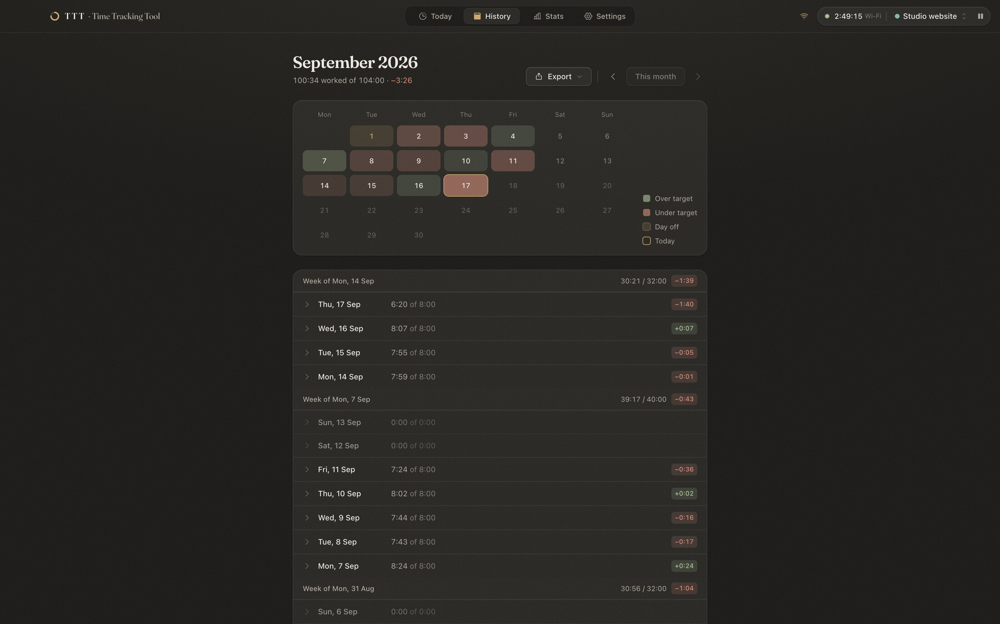
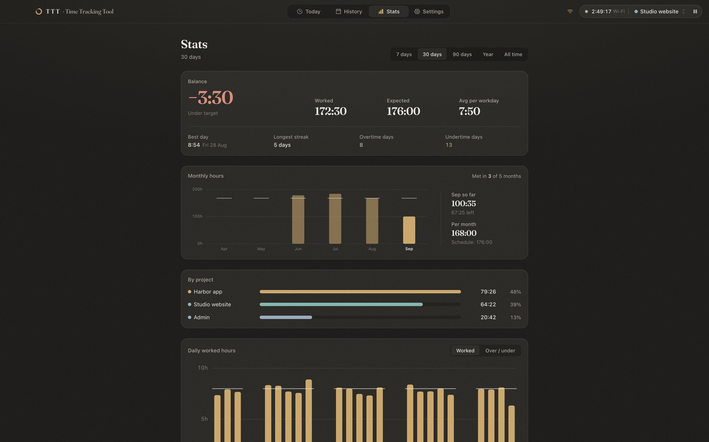
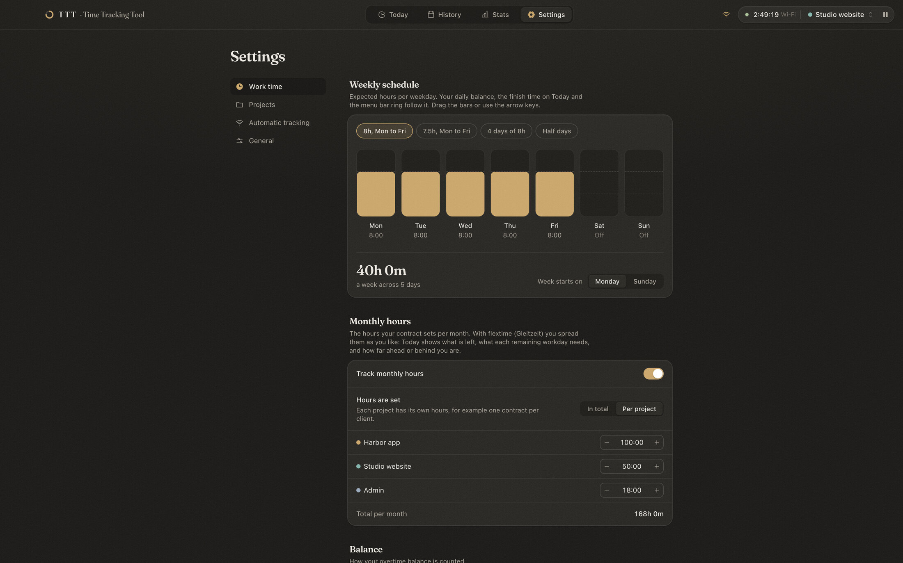

<p align="center">
  
</p>

<h1 align="center">TTT <sup><kbd>beta</kbd></sup></h1>

<p align="center">
  <b>Time Tracking Tool.</b> A calm macOS menu bar app for your working hours and overtime balance.
</p>

<p align="center">
  <a href="https://github.com/cayox/TTT/releases/latest"><b>Download for macOS</b></a>
</p>


> [!NOTE]
> TTT is in **beta**. It is used daily, but expect rough edges, and keep an eye on your data after updates. Please [open an issue](https://github.com/cayox/TTT/issues) for anything that looks wrong.

## What it does

- **One click to start.** Start or pause from the window, the menu bar menu or <kbd>⌘</kbd><kbd>↩</kbd>. The menu bar ring fills up as you work through the day and shows a dot while the timer runs.
- **A running overtime balance.** Set your expected hours per weekday. TTT keeps the difference between what you worked and what you were expected to work, day by day, including a balance you carry over from before.
- **Hands-free at the office.** Add your work Wi-Fi and TTT starts when you join it and stops a few minutes after you leave. If macOS hides the network name, TTT recognizes the network by its router.
- **Projects.** Every session belongs to a project, so you can see where the time went, today and over any range.
- **Days off.** Mark vacation, sick days and holidays in History. Credited days count as a full workday, so they never leave a deficit.
- **Monthly hours with flextime.** Enter the hours from your contract, in total or per project. With flextime (Gleitzeit) TTT shows what is left this month, what each remaining workday needs, and how far ahead or behind you are.
- **Export.** A printable A4 timesheet as PDF with signature lines, or a short summary for WhatsApp.
- **Private.** Everything is stored locally in SQLite. No account, no server.

## Screenshots

|                                                                               |                                                                                        |
| ----------------------------------------------------------------------------- | -------------------------------------------------------------------------------------- |
|  |  |
| **History.** Month heatmap, sessions grouped by week, days off.               | **Stats.** Balance, monthly hours and projects over 7 days to all time.                |
|   |  |
| **Setup.** A short first-run guide: work week, projects, Wi-Fi.               | **Settings.** Work time, projects, automatic tracking, general.                        |

## Install

1. Download the `.dmg` for your Mac from the [latest release](https://github.com/cayox/TTT/releases/latest): `arm64` for Apple Silicon, `x64` for Intel.
2. Open it and drag **TTT** to Applications.
3. TTT is not notarized by Apple, so the first launch is blocked. Right-click TTT in Applications and choose **Open**, or run:

```bash
xattr -dr com.apple.quarantine /Applications/TTT.app
```

macOS only reveals Wi-Fi names to apps with Location access, so TTT asks for it when you switch automatic tracking on — during onboarding or in Settings → Automatic tracking, which also has an **Allow location access** button. Say no and everything still works: TTT then recognizes a work network by its router instead of its name. Because the app is only ad-hoc signed, macOS may ask again after an update.

## Updates

TTT looks at its own [GitHub releases](https://github.com/cayox/TTT/releases) a few times a day and offers what it finds. You see the release notes before anything is downloaded, and nothing installs until you say so. Turn the checking off in **Settings → General → Updates**, where you can also check by hand and read the full changelog under **What's new**.

Choosing **Update** downloads the zip for your Mac, checks it against the checksum GitHub publishes, confirms the build really is the version it claims and that its signature is intact, and only then replaces the app and restarts it. If that last step fails, the old version is put straight back. TTT needs to be somewhere it can write, such as Applications — from a read-only volume it will point you to the release page instead.

Every change is written down in [CHANGELOG.md](CHANGELOG.md), which is also what the release notes are made of.

## Keyboard shortcuts

| Shortcut                                             | Action                              |
| ---------------------------------------------------- | ----------------------------------- |
| <kbd>⌘</kbd><kbd>↩</kbd>                             | Start or pause, anywhere in the app |
| <kbd>Space</kbd>                                     | Start or pause on Today             |
| <kbd>⌘</kbd><kbd>1</kbd> to <kbd>⌘</kbd><kbd>4</kbd> | Today, History, Stats, Settings     |
| <kbd>←</kbd> <kbd>→</kbd>                            | Previous or next month in History   |

## Development

Electron, React, Tailwind CSS and SQLite (better-sqlite3), built with electron-vite. macOS only.

```bash
npm install
```

```bash
npm run dev
```

| Script              |                                                       |
| ------------------- | ----------------------------------------------------- |
| `npm run dev`       | Run the app with hot reload                           |
| `npm test`          | Unit tests (Vitest)                                   |
| `npm run typecheck` | TypeScript                                            |
| `npm run build`     | Production bundle in `out/`                           |
| `npm run dist`      | Package DMG and zip for arm64 and x64 into `release/` |

```
src/
  main/       Electron main process: window, tray, IPC, SQLite, Wi-Fi watcher, export, updater
  preload/    Typed bridge between main and renderer
  renderer/   React app: pages, components, design tokens
  shared/     Types and pure logic (time math, stats, monthly hours), unit tested
build/        App icon sources, the Wi-Fi helper and the release-notes script
```

The app icon is drawn in `build/icon.svg`; `build/make-icon.sh` renders `icon.png` and `icon.icns`. The menu bar glyph is drawn in code in `src/main/tray/icon.ts`.

## Releases

[`.github/workflows/release.yml`](.github/workflows/release.yml) typechecks, tests and packages every push and pull request, and keeps the DMGs as workflow artifacts. Pushing a version tag publishes a GitHub release with the DMGs and zips attached:

```bash
git tag v0.2.0-beta.1 && git push origin v0.2.0-beta.1
```

The app version comes from the tag, so `package.json` does not need a bump. Tags with a suffix such as `-beta.1` are published as pre-releases, and only reach people who already run a pre-release.

The release description comes from `CHANGELOG.md`, so add a section for the version before tagging:

```markdown
## [0.2.0-beta.1] - 2026-10-01

### Added

- What changed, in a sentence someone else would understand.
```

`npm run release-notes 0.2.0-beta.1` prints what the release will say, and the workflow fails when the section is missing — the app shows these notes before it updates, so a release without them is a bug.
